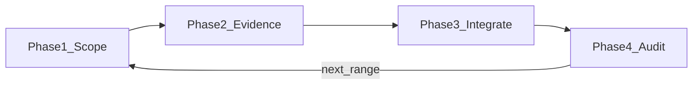

# Manuscript citation workflow

Section-scoped LaTeX + BibTeX citation: per-sentence decisions, triple-pool retrieval, subagent evidence packs, placeholder briefs, compliance audit.

**Related:** [zotero.md](zotero.md) · Contract §4 · Kit [../SKILL.md](../SKILL.md)

Discover venue and file names from the repo and the user’s scope message.

## Workflow overview

| Phase | Owner | Purpose |
|-------|--------|---------|
| **1 — Scope** | Parent | Policy, worklist, parallel mode, Zotero status |
| **2 — Evidence** | Subagents (required) | Per-sentence records + triple-pool when triggered |
| **3 — Integrate** | Parent | Merge `.bib`, update `.tex`, placeholder outcomes |
| **4 — Audit** | Parent | Ledger completeness, claim–abstract fit |

**Hard rules:**

| # | Requirement |
|---|-------------|
| R1 | Every sentence in scope → ledger row and decision **A / B / C / D / E**. |
| R2 | Phase 2 uses **subagents** — one per sentence (≤30 in scope) or one per paragraph (>30). Inline-only if user requests a **single-sentence dry run**. |
| R3 | **Triple-pool** (`.bib` + Zotero MCP + network) in parallel for cite briefs or external support (A validate, B replace, open placeholder). Zotero down → `.bib` + network; state in report. |
| R4 | **C (no cite)** without a cite brief may skip triple-pool after a one-line claim-only rationale. |
| R5 | Claim-first — each `\cite{}` supports that sentence’s claim. |
| R6 | **Cite brief supremacy** — honor author briefs (counts, mandatory works, fallbacks, conditional no-cite). |
| R7 | Open placeholders stay in `.tex` until the brief is fully satisfied; provisional `\cite{}` may follow the marker. |

## Inputs (discover per run)

| Input | How to obtain |
|-------|----------------|
| Manuscript `.tex` | User scope or contract §0 |
| Master `.bib` | Beside `.tex`; confirm from `\bibliography{}` / `\addbibresource{}` |
| Citation policy | Contract §4, `.tex` header, `AGENTS.md`, or user message |
| Temp workspace | e.g. `manuscript/.citation-workflow/<range-id>/` |

## Author cite briefs

**Cite brief** markers:

- `【cite: …】` or `【cite：…】`

Other markers (`【待扩写】`, `【待补充】`, …) are content placeholders unless they embed a `cite` directive.

**Brief clause types:** topic/scope; count + genre; mandatory source; exclusion; conditional no-cite; fallback; prose tweak allowed.

| Status | `.tex` |
|--------|--------|
| **Closed** | Remove marker; final `\cite{...}` (or no cite per brief) |
| **Open — unmet** | Keep marker |
| **Open — partial** | Keep marker; optional provisional `\cite{...}` after |
| **Open — fallback** | Keep marker; `\cite{fallbackKey}` after |

## Phase 1 — Scope (parent)

1. Read citation policy.
2. Confirm Zotero MCP ([zotero.md](zotero.md)).
3. Fix exact range.
4. Build sentence worklist (every sentence; split on `.` `?` `!`).
5. Tag: `placeholder-governed` vs `default`; note existing `\cite{}`.
6. Parallel mode: ≤30 → subagent/sentence; >30 → subagent/paragraph (still one record per sentence).

## Phase 2 — Evidence (subagents)

Triple-pool when: cite brief present; or default needing A/B / TBD cite. Skip for default **C** with rationale.

Pools (equal weight, parallel): **`.bib`** · **Zotero** · **Network** (Crossref, PubMed, arXiv, publisher pages). Reconcile: union → dedupe → rank inside brief bounds.

Subagents: write only under temp workspace; return sentence record + optional BibTeX snippets. Parent merges ledger and keys.

## Decisions A/B/C/D/E

| Code | When |
|------|------|
| **A** | Keep/affirm current `\cite{}` |
| **B** | Replace weak/indirect cite |
| **C** | No external cite needed |
| **D** | Placeholder **closed** |
| **E** | Placeholder **open** |

## Phase 3 — Integrate (parent)

Merge BibTeX into master `.bib`; update `.tex` per closed/open/A/B/C; prose only for claim accuracy or brief-allowed micro-edits.

## Phase 4 — Audit (parent)

Coverage, claim↔abstract fit, brief compliance, keys, policy fields (e.g. `abstract` on entries). No new search.

## Ledger fields (report)

`id`, `location`, `snippet`, `tag`, `decision`, `pools`, `keys`, `brief_status`, `rationale`. Plus placeholder ledger when briefs exist.

## Completion report

1. Scope · 2. Sentence ledger · 3. Placeholder ledger · 4. Changes · 5. Evidence · 6. Risks

## Quality checklist

- [ ] Every in-scope sentence in ledger with A–E
- [ ] Subagents at correct granularity (R2)
- [ ] Triple-pool documented when triggered (R3)
- [ ] Briefs closed or open with subtype
- [ ] Open briefs still in `.tex` (R7)
- [ ] Claim-specific cites (R5)
- [ ] Policy fields satisfied
