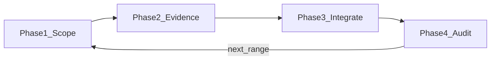

# Manuscript citation workflow

Section-scoped LaTeX + BibTeX: per-sentence decisions, triple-pool retrieval, evidence packs, placeholder briefs, audit.

**Related:** [zotero.md](zotero.md) · Contract §4 · [../SKILL.md](../SKILL.md)

## Workflow overview

| Phase | Owner | Purpose |
|-------|--------|---------|
| **1 — Scope** | Parent | Policy, worklist, parallelism tier, Zotero status |
| **2 — Evidence** | Prefer subagents | Per-sentence records + triple-pool when triggered |
| **3 — Integrate** | Parent | Merge `.bib`, update `.tex` |
| **4 — Audit** | Parent | Ledger + claim–abstract fit |

## Hard rules

| # | Requirement |
|---|-------------|
| R1 | Every sentence → ledger row + decision **A–E**. |
| R2 | Phase 2 parallelism — see **tiers** below. Prefer subagents when available; **always finish** with a documented tier. |
| R3 | Triple-pool (`.bib` + Zotero + network) when cite brief or external support needed. Zotero down → `.bib` + network; state in report. |
| R4 | **C** without brief may skip triple-pool with one-line rationale. |
| R5 | Claim-first cites. |
| R6 | Cite brief supremacy. |
| R7 | Open placeholders stay until brief satisfied; provisional `\cite{}` may follow marker. |

### R2 parallelism tiers

| Tier | When | Behavior |
|------|------|----------|
| **full** | Default when Task/subagents work; ≤30 sentences → one agent/sentence; >30 → one agent/paragraph | Max parallelism |
| **batched** | Large scope or cost control | Groups of ~8 sentences per subagent (still one ledger row per sentence) |
| **inline** | No subagent/Task tool; user asks dry-run; or full failed | Parent runs Phase 2 sequentially; report `tier: inline` |

User may set tier in the request or contract §0 (`Citation parallelism`). Unspecified → try **full**, else **inline** (do not abort the pass).

## Inputs

Manuscript `.tex` · master `.bib` · citation policy · temp e.g. `manuscript/.citation-workflow/<range-id>/`

## Author cite briefs

Markers: `【cite: …】` / `【cite：…】`. Other `【待*】` markers are not cite briefs unless they embed `cite`.

Brief clauses: topic; count+genre; mandatory source; exclusion; conditional; fallback; prose tweak allowed.

| Status | `.tex` |
|--------|--------|
| Closed | Remove marker; final cite or no-cite per brief |
| Open unmet / partial / fallback | Keep marker; provisional cite rules as before |

## Phase 1 — Scope

Policy · Zotero status · exact range · sentence worklist · tag placeholder vs default · choose **tier** · record sentence count.

## Phase 2 — Evidence

Triple-pool when brief or A/B/TBD. Pools equal weight; reconcile union → dedupe → rank inside brief. Write only under temp; parent merges.

## Decisions A–E

**A** keep · **B** replace · **C** no cite · **D** placeholder closed · **E** placeholder open

## Phase 3–4

Integrate · audit (no new search). Ledger fields: `id, location, snippet, tag, decision, pools, keys, brief_status, rationale` (+ `tier`).

## Completion report

Scope (incl. tier) · sentence ledger · placeholder ledger · changes · evidence · risks

## Quality checklist

- [ ] Every sentence in ledger with A–E  
- [ ] Tier documented (R2); subagents used when tier is full/batched and available  
- [ ] Triple-pool when triggered (R3)  
- [ ] Briefs closed or open with subtype  
- [ ] Open briefs still in `.tex` (R7)  
- [ ] Claim-specific cites (R5)  
